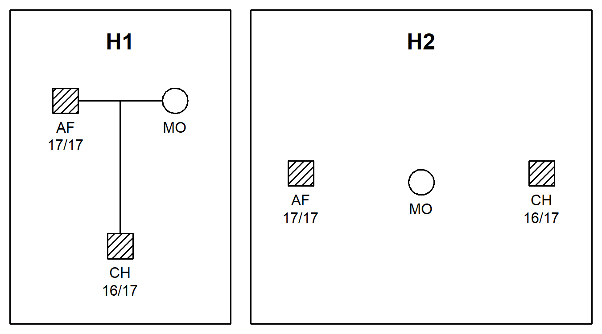

<!-- README.md is generated from README.Rmd. Please edit that file -->

# pedFamilias

<!-- badges: start -->
<!-- badges: end -->

The purpose of **pedFamilias** is to facilitate data exchanging between
the **pedsuite** packages and the [Familias](https://familias.name/)
software. The main functions are `readFam()` and `writeFam()` for
reading and writing .fam files associated with Familias. Notably, .fam
files written with the DVI module of Familias are supported, and also
database files without pedigree information.

These functions were originally part of
[**forrel**](https://github.com/magnusdv/forrel), but were split out to
streamline maintenance and provide a more lightweight import for other
packages otherwise independent of **forrel**.

## Installation

You can install the development version of **pedFamilias** from GitHub
with:

``` r
# install.packages("remotes")
remotes::install_github("magnusdv/pedFamilias")
```

## Example

``` r
library(pedFamilias)
```

For a simple illustration of **pedFamilias** we read the example file
`paternity.fam` shipped with the package:

``` r
fam = system.file("extdata", "paternity.fam", package = "pedFamilias")

peds = readFam(fam)
#> Familias version: 3.3.1
#> Read DVI: No
#> 
#> Number of individuals (excluding 'extras'): 3
#>   Individual 'AF': Genotypes for 10 markers read
#>   Individual 'MO': Genotypes for 0 markers read
#>   Individual 'CH': Genotypes for 10 markers read
#> 
#> Number of pedigrees: 2
#>  Pedigree 'H1' (0 extra females, 0 extra males)
#>  Pedigree 'H2' (0 extra females, 0 extra males)
#> 
#> Database: unknown
#> Number of loci: 10
#>   D3S1358: 12 alleles, mut model (M/F) = step-ext, rate = 0.002/0.001, range = 0.1, rate2 = 1e-06
#>   TH01: 10 alleles, mut model (M/F) = step-ext, rate = 0.002/0.001, range = 0.1, rate2 = 1e-06
#>   D21S11: 26 alleles, mut model (M/F) = step-ext, rate = 0.002/0.001, range = 0.1, rate2 = 1e-06
#>   D18S51: 23 alleles, mut model (M/F) = step-ext, rate = 0.002/0.001, range = 0.1, rate2 = 1e-06
#>   PENTA_E: 21 alleles, mut model (M/F) = step-ext, rate = 0.002/0.001, range = 0.1, rate2 = 1e-06
#>   D5S818: 9 alleles, mut model (M/F) = step-ext, rate = 0.002/0.001, range = 0.1, rate2 = 1e-06
#>   D13S317: 9 alleles, mut model (M/F) = step-ext, rate = 0.002/0.001, range = 0.1, rate2 = 1e-06
#>   D7S820: 19 alleles, mut model (M/F) = step-ext, rate = 0.002/0.001, range = 0.1, rate2 = 1e-06
#>   D16S539: 9 alleles, mut model (M/F) = step-ext, rate = 0.002/0.001, range = 0.1, rate2 = 1e-06
#>   CSF1PO: 11 alleles, mut model (M/F) = step-ext, rate = 0.002/0.001, range = 0.1, rate2 = 1e-06
#> 
#> Converting to `ped` format
#> 
```

Here are the pedigrees, including genotypes for the first marker:

``` r
plotPedList(peds, hatched = typedMembers, marker = 1)
```



For further analysis of the data, check out the **forrel** package. For
instance, the command `forrel::kinshipLR(peds)` computes the likelihood
ratio.
